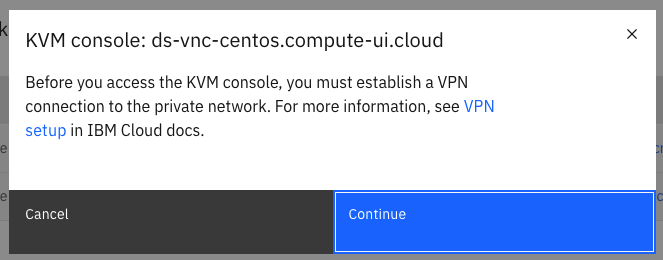
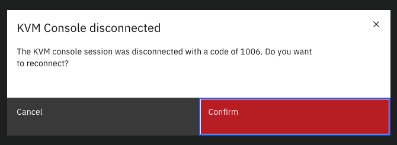

---

copyright:
  years: 2021
lastupdated: "2021-08-05"

keywords: classic virtual servers, access kvm console, connect to virtual server

subcollection: virtual-servers

---

{:shortdesc: .shortdesc}
{:codeblock: .codeblock}
{:screen: .screen}
{:new_window: target="_blank"}
{:pre: .pre}
{:tip: .tip}
{:table: .aria-labeledby="caption"}
{:important: .important}
{:note: .note}

# Accessing the KVM console
{: #access-kvm-console}

You can now access the KVM console of your virtual servers from the {{site.data.keyword.cloud}} console.

The KVM console feature is gradually coming to all data centers. If your virtual servers don't have access to it now, try again later. You can also contact your IBM Sales representative for more information on the availability status of this feature.
{: note}

The KVM console provides a graphical user interface and accepts both mouse and keyboard input. You can open the KVM console by using any of the {{site.data.keyword.cloud}} supported browsers. For more information about {{site.data.keyword.cloud}} supported browsers, see [Browsers](/docs/overview?topic=overview-prereqs-platform#browsers-platform).

The KVM console is a quick-and-easy way for you to configure and administer your virtual servers. It applies to situations where a boot failure or kernel crash occurred. When these situations happen, you can use the console to examine the issue.

## Prerequisites
{: #prereqs}

1. Before you can access the KVM console of a virtual server, you must establish a VPN connection to the private network.

  For more information about connecting to the VPN, see [Connecting to SSL VPN (Windows 7 and higher)](/docs/iaas-vpn?topic=iaas-vpn-connect-ssl-vpn-windows7) or [Connecting to an SSL VPN (MacOS)](/docs/iaas-vpn?topic=iaas-vpn-connect-ssl-vpn-mac-osx).

2. The virtual server must be powered on to get a KVM console connection started.

## Using the {{site.data.keyword.cloud}} console to connect to the KVM console
{: #connect-to-console-using-ui}

Use the following steps to connect to a console by using {{site.data.keyword.cloud}} console.

1. In the {{site.data.keyword.cloud}} UI console, find your virtual server in the **Device List**, click the name of the virtual server to enter the details page.

2. Click **Actions** > **KVM Console**.

3. In the VPN notification window, click **Continue**.

  {: caption="Figure 1. VPN notification window" caption-side="top"}

4. In the KVM console window, enter your credentials to log in to the virtual server.

## Actions that are available in the KVM console window
{: #available-actions}

In the KVM console window, you can restart, power on, and power off the virtual server. To perform these actions, click the overflow icon on the upper right of the console's window, then click the appropriate action.

You can also use the "Ctrl + Alt + Del" key combination from the actions.
{: tip}

If the console is disconnected, you can reconnect to it by clicking **Reconnect**. 

## Disconnecting from the KVM console
{: #disconnect}

When you're finished with the console, you can disconnect from it by closing the browser window.

## Notes on the KVM console
{: #notes}

1. The **KVM Console disconnected** notification appears anytime the console either can’t connect or gets disconnected in the middle of a session. The code in the text is displayed only if the disconnection was unexpected. It helps debug find why the connection is failing. On a regular disconnection, no code is displayed.

  {: caption="Figure 1. KVM console disconnection window" caption-side="top"}

2. The KVM Console opens in a new browser tab or window. If the KVM Console doesn't open, check the browser for any blocked new windows.
